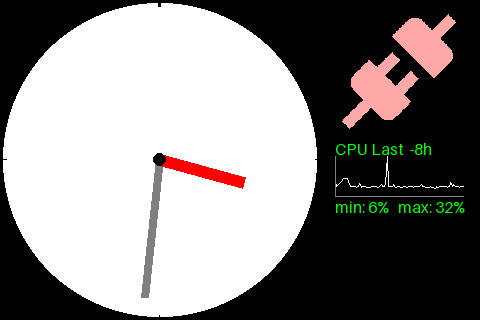

# Contents
 [1. What is it?](#1-what-is-it)  
 [2. How to install?](#2-how-to-install)  
 [3. How to set up?](#3-how-to-set-up)  
 [4. GUI Options explained](#4-gui-options-explained)  
 [5. How to use?](#5-how-to-use)  
 [6. all services explained](#6-all-services-explained)  
 [7. Examples](#7-examples)  
 [8. Worthy Notes](#8-worthy-notes)  



---
## 1. What is it?
You have a display that runs under windows and not with Linux/HomeAssistant. So I wanted to use the display with HomeAssistant,
to get some states more directly and clear onto the display.
To get in touch wih the protocol, I needed to re-engineer some of the USB messages using wireshark.

---
## 2. How to install?
In Home Assistant, go to HACS and add https://github.com/rossi75/WeAct4HA as an integration. Filter for WeAct, press the download button (lower right at the date of writing).
Navigate to Settings/Devices. If you already have plugged in your device, a new device should be discovered on the top. If it is not recognized automatically, add the integration via the button (lower right at the date of writing)
As soon as it is installed, the display shows the RGB colors and returns to a black screen. Now it's up to you to fill the display with some content

---
## 3. How to set up?
you have the initial screen where you can set some things like the device itself, the orientation, brightness, background color and the screencare option.
- choose the device you want to set up and add to your configuration
- choose the desired orientation from landscape/landscape reverse/portrait/portrait reverse. You can change this later directly in the device options
- set the standard brightness after startup. You can set this also later directly in the device options
- choose the background color. Later, you cannot change this setting via the device options, only via the actions/services in the developer menu. This is due to the fact that there is no property that gives me the possibility to ONLY have a color picker
- for normal operation, the display shows in 24 hours nearly always the same. So I added a screencare option. With this option enabled, the display is filled with many random pixels. Every day at 03:37:00 to 03:37:59. 03:37 is the standard Gigaset reset time. If you don't want this because you need the display at 03:37 in the night, please disable this option
- click OK, done !

---
## 4. GUI Options explained
Here I will explain the few GUI options.
- change the Brightess - as explained in #3
- Clock Mode
  You can choose between 3 options: idle|digital|analog
  in idle mode, nothing is being displayed on the display from the integration itself
  in digital mode, a digital clock is being displayed in the center of the display with standard colors
  in analog mode, an analog clock is being displayed with standard colors
  If you need any customization on a clock, you need to call the service manually and customize the settings
- Orientation - as explained in #3
- Screencare - as explained in #3

If the display is equipped with a humiture sensor, those values are reported in the Sensors section. Humidity and Temperature is shown here.

If you take a look at the displays entities (developer tools/states/sensor.weact_display_*), you will notice some attributes. Turn on the developer options to see much more of them...


---
## 5. How to use?
For testing and a one-shot i recommend using the actions in the developer tools. As Home Assistant only reports back the internal device ID, we need this for every operation to read out the database
then simply start using the display in any automation. Scribble some text, draw a diagram, anything you need... Examples below

Everytime an update is being sent to the display, a replica is taken into your ../custom_components/weact_display/bmp/ directory. Only the last 20 images are being kept. You can copy the replica with WinSCP if you are fast enough

---
## 6. all services explained
Well, this will be a long list. I will try to abbreviate it as much as possible

---
## 7. Examples
a) First of all I have the clock. Here I created an automation that runs 10 minutes after startup and enables the analog clock:
```
alias: display clock at startup
triggers:
  - trigger: event
    event_type: weact_display_ready
  - trigger: homeassistant
    event: start
conditions: []
actions:
  - delay:
      hours: 0
      minutes: 10
      seconds: 0
      milliseconds: 0
  - action: weact_display.start_analog_clock
    data:
      display: 433e5e413e13f7960ba789988b4e21b3
mode: single
```
b) Next is my DSL. As this sometimes starts flattering, I wanted to have an optical message for this, a red icon appears.  
As soon as the connection is back in town, the icon is painted green and after 10 minutes of a stable connection, the icon gets black (as my background color):

```
alias: DSL Verfügbarkeit
triggers:
  - entity_id:
      - binary_sensor.fritz_box_7590_verbinden
    trigger: state
conditions: []
actions:
  - alias: Icon auf WeAct Display
    choose:
      - conditions:
          - alias: Getrennt
            condition: state
            entity_id: binary_sensor.fritz_box_7590_verbinden
            state:
              - "off"
        sequence:
          - alias: Icon rot färben
            action: weact_display.show_icon
            metadata: {}
            data:
              icon_name: mdi:connection
              icon_color:
                - 255
                - 168
                - 168
              xs: 335
              ys: 8
              icon_size: 128
              rotation: 0
              display: 433e5e413e13f7960ba789988b4e21b3
        alias: " getrennt ==> Displayicon zeigen"
      - conditions:
          - alias: wieder verbunden
            condition: state
            entity_id: binary_sensor.fritz_box_7590_verbinden
            state:
              - "on"
        sequence:
          - alias: Icon grün färben
            action: weact_display.show_icon
            metadata: {}
            data:
              icon_name: mdi:connection
              icon_color:
                - 0
                - 255
                - 0
              xs: 335
              ys: 8
              icon_size: 128
              rotation: 0
              display: 433e5e413e13f7960ba789988b4e21b3
          - delay:
              hours: 0
              minutes: 10
              seconds: 0
              milliseconds: 0
          - alias: Icon schwarz färben
            action: weact_display.show_icon
            metadata: {}
            data:
              icon_name: mdi:connection
              icon_color:
                - 0
                - 0
                - 0
              xs: 335
              ys: 8
              icon_size: 128
              rotation: 0
              display: 433e5e413e13f7960ba789988b4e21b3
        alias: " verbunden ==> Displayicon verbergen"
mode: restart
```

c) display the CPU load, the last values are stored into a helper text variable (input_text.cpu_history),
which stores the data semikolon-seperated ("8;7;7;9;8;8;7;8;8;8;9;8;11;8;9;10;12;13;14;14;14;11;8;8;8;8;7;8;10;7;8"). A text-field can be up to 255 characters, so I can store about 83 entries, which is about 8 hours backwards.

```
alias: CPU load
description: >-
  erfasst alle 5 Minuten die CPU-Temperatur und schickt die neue Liste ans
  Display
triggers:
  - trigger: time_pattern
    minutes: /5
    hours: "*"
conditions: []
actions:
  - action: input_text.set_value
    target:
      entity_id: input_text.cpu_history
    data:
      value: >
        
        
        
        {{ (history[-83:] + [value]) | join(';') }}
    alias: Aktuelle CPU-Last lesen und speichern
  - action: weact_display.write_text
    alias: Überschrift malen
    data:
      text: CPU Last  -8h
      t_color:
        - 0
        - 255
        - 0
      font_size: 16
      x_start: 335
      y_start: 139
      x_end: 463
      y_end: 155
      display: 433e5e413e13f7960ba789988b4e21b3
  - alias: Diagramm malen
    action: weact_display.draw_line_chart
    data:
      x_start: 335
      y_start: 156
      x_end: 463
      y_end: 196
      line_values: "{{ states('input_text.cpu_history') }}"
      line_width: 1
      line_color:
        - 255
        - 255
        - 255
      mark_points: false
      ground_to_zero: true
      display: 433e5e413e13f7960ba789988b4e21b3
      clear_workspace: true
      axis_color:
        - 128
        - 128
        - 128
  - action: weact_display.write_text
    alias: Min/Max ermitteln
    data:
      text: >
         min: {{ values | min }}%   max: {{ values | max }}%        
      t_color:
        - 0
        - 255
        - 0
      font_size: 16
      x_start: 335
      y_start: 197
      x_end: 463
      y_end: 213
      display: 433e5e413e13f7960ba789988b4e21b3
mode: single
```

---
## 8. Worthy Notes
- the icon is KI generated
- ChatGPT helped me with explaining the Home Assistants architecture
- you need to call every service with its device ID. Internally the integration works with the serial number
- if you face any issue, report it to me

